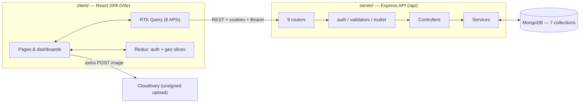
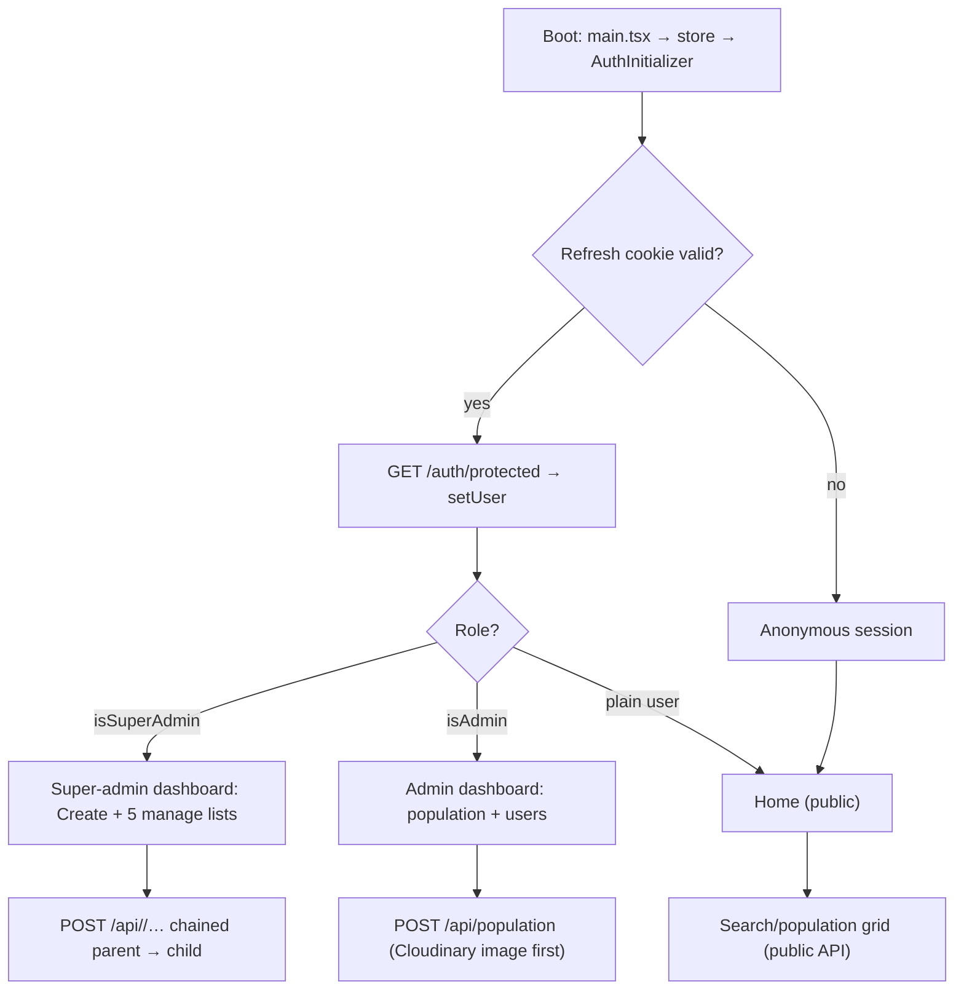
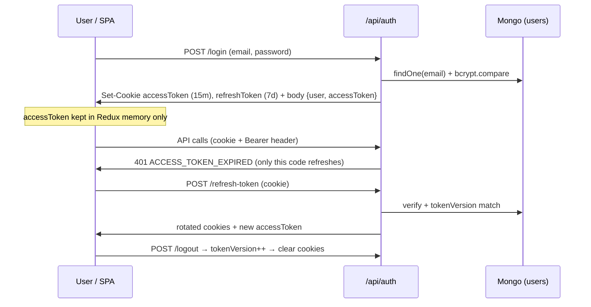

# Bangladesh Civil Registry

A full-stack civil registry for Bangladesh: a public ledger of the country's five-tier geography (Division → District → Upazila → Union → Village) plus a searchable population register linked to every tier. It ships as two packages — an Express + MongoDB REST API (`server/`) and a React + Vite single-page application (`client/`) with role-based admin and super-admin dashboards.

## Overview

- **Public side:** live registry totals, a divisions ledger, and a searchable, paginated population grid — no login required.
- **Admin side:** population registration (with photo upload), a paginated population table, and user/role management.
- **Super-admin side:** guided top-to-bottom creation of geography records plus searchable, paginated manage lists with rename and delete.
- **Auth:** cookie-based JWT (15-minute access token, 7-day rotating refresh token) with silent refresh, server-side revocation, and client route guards.

> There is no public demo URL referenced anywhere in the repository, and no screenshots are checked in — run it locally (see below).

## Features

- Public registry landing: live counts, divisions ledger, population cards with search + pagination + page-size control.
- Email/password registration and login with role-based redirects.
- Silent session restore on reload and single-flight access-token refresh.
- Admin user table: server-side search/pagination, inline role assignment (`user` / `admin` / `super-admin`), delete.
- Population table (admin): photo, contact, and all five geography tiers per row, with search and pagination.
- Add-population wizard: details form + five cascading geography pickers + Cloudinary image upload.
- Geography builder (`Create Items`): five ordered steps, each with parent pickers and validation.
- Geography manage lists: debounced search, client pagination, rows-per-page, edit dialog, delete.
- Dark/light theme, collapsible sidebar, mobile drawer dashboard shell.
- One-command demo seeding (`npm run seed`) that rebuilds the hierarchy, users, and population records.

## Tech Stack

**Client (`client/package.json`)**

| Category | Libraries |
|---|---|
| UI / framework | `react` 18.3, `react-dom` 18.3, `react-router-dom` 7.1 |
| Language / build | `typescript` 5.6 (strict), `vite` 6, `@vitejs/plugin-react` 4.3 |
| State / data | `@reduxjs/toolkit` 2.5, `react-redux` 9.2, `axios` 1.7 (single Cloudinary call) |
| Forms / validation | `react-hook-form` 7.54, `zod` 3.24, `@hookform/resolvers` 3.9 |
| Styling | `tailwindcss` 3.4, `tailwindcss-animate`, `class-variance-authority`, `clsx`, `tailwind-merge`, `next-themes` |
| Components / icons | Full Radix suite (`dialog`, `select`, `popover`, `command` via `cmdk`, …), `lucide-react` |
| Misc installed | `date-fns`, `recharts`, `sonner`, `vaul`, `embla-carousel-react`, `input-otp`, `react-day-picker`, `react-resizable-panels`, `@cloudinary/react`, `@cloudinary/url-gen`, `cloudinary-react` |

**Server (`server/package.json`)**

| Category | Libraries |
|---|---|
| HTTP / framework | `express` 4.21, `cors`, `cookie-parser`, `morgan`, `http-errors` |
| Data | `mongoose` 8.8 |
| Auth / security | `jsonwebtoken` 9, `bcryptjs` 2.4, `express-validator` 7.2 |
| Uploads | `multer` 1.4 (disk, 5 MB, jpeg/png/gif), `cloudinary` 2.5 SDK |
| Config / runtime | `dotenv` 16.4, `nodemon` 3.1 (also used by `npm start`) |

**Database:** MongoDB (connection string via `MONGODB_URL`). No ORM beyond Mongoose, no cache, no message queue.

## Architecture



Response dialects (as implemented): geography/user routes return `{ success, message, payload }` via `controller/responesController.js`; auth/population/public routes return hand-rolled `{ success, message, user | users + pagination }` shapes.

## How It Works

1. `client/src/main.tsx` creates the Redux store, theme provider, router, and toaster.
2. `client/src/App.tsx` mounts `AuthInitializer`, which blocks the UI on a spinner, calls `POST /api/auth/refresh-token` from the httpOnly cookie, then `GET /api/auth/protected` to repopulate `auth.user` (or logs out).
3. Public visitors browse `page/Home.tsx`: three parallel queries (`publicApi` stats + divisions, `populationApi` grid).
4. Login stores the access token **in Redux memory only**; every RTK Query request sends it as `Authorization: Bearer` plus cookies (`credentials: "include"`).
5. Admins manage people; super-admins manage geography. Mutations invalidate RTK Query tags (and most pages also call `refetch()`).
6. The five cascading pickers (`components/comboItem/`) share selections through the global `geoSlice` (IDs + names), consumed by the add-population form and the geography add forms.

## Application Flow



## Authentication



Verified details:

- Registration (`POST /api/users/register`) is guarded by `isLoggedOut`; passwords require 6–20 chars with upper/lower/number/special (server), confirmed via `confirmPassword`.
- Access payload: `{ id, email, isAdmin, isSuperAdmin }` (15 m). Refresh payload: `{ id, tokenVersion }` (7 d).
- Cookies are `httpOnly`, `secure` + `sameSite: "none"` only when `NODE_ENV=production`, else `lax`.
- `middleware/auth.js` accepts Bearer header **or** cookie and emits distinct 401 codes: `NO_ACCESS_TOKEN`, `ACCESS_TOKEN_EXPIRED`, `INVALID_ACCESS_TOKEN`.
- `services/baseQuery.ts` refreshes **only** on `ACCESS_TOKEN_EXPIRED` (single-flight with a queued-retry queue); any other 401 dispatches `logout()`.
- Client guards (`router/AdminRoute.tsx`, `SuperAdminRoute.tsx`, `ProtectedRoute.tsx`) render `<SignIn />` inline when the role check fails; the server re-enforces authorization per route.

## API Architecture

Base URL: `VITE_API_URL` or `http://localhost:4000/api`. All geography/user reads and all mutations require login; noted otherwise.

| Method & path | Guards | Purpose |
|---|---|---|
| `POST /api/auth/login` | logged-out + validators | Authenticate, set cookies, return user + token |
| `POST /api/auth/logout` | — | Revoke refresh (`tokenVersion++`), clear cookies |
| `POST /api/auth/refresh-token` | refresh cookie | Rotate both tokens |
| `GET /api/auth/protected` | `isLoggedIn` | Current user (no password) |
| `POST /api/users/register` | logged-out + validators | Create standard account |
| `GET /api/users?page&limit&search` | `isLoggedIn` + `isAdmin` | Paginated user table (searches name/email) |
| `GET /api/users/:id` | `isLoggedIn` | Single account |
| `PUT /api/users/:id` | `isLoggedIn` + `isAdmin` | Update (only `name` is applied; `email` rejected) |
| `DELETE /api/users/:id` | `isLoggedIn` + `isAdmin` | Delete account |
| `PUT /api/users/manage-state/:id` | `isLoggedIn` | Set role flags from `{ role }` |
| `GET /api/public/stats` | public | Six collection counts |
| `GET /api/public/divisions` | public | Division names |
| `GET /api/population?page&limit&search` | public | Population grid (searches name/email/phone/tag, populates 5 tiers) |
| `POST /api/population` | `isLoggedIn` + `isAdmin` | Create record (duplicate email/phone rejected) |
| `GET /api/population/:id` | `isLoggedIn` | Single record |
| `PUT /api/population/:id` | `isLoggedIn` | Update record |
| `DELETE /api/population/:id` | `isLoggedIn` + `isSuperAdmin` | Delete record |
| `PUT /api/population/manage-state/:id` | `isLoggedIn` + `isSuperAdmin` | Role-style update passthrough |
| `POST /api/divisions` | `isLoggedIn` + `isSuperAdmin` + `validateName` | Create division |
| `GET /api/divisions` | `isLoggedIn` | All divisions (deep-populates full tree) |
| `GET /api/divisions/:divisionId` | `isLoggedIn` + `isSuperAdmin` | Single division |
| `PUT /api/divisions/:divisionId` | `isLoggedIn` + `isSuperAdmin` | Rename |
| `DELETE /api/divisions/:divisionId` | `isLoggedIn` + `isSuperAdmin` | Delete (no cascade) |
| `GET /api/districts` | `isLoggedIn` | All districts (flat) |
| `GET /api/districts/:divisionId` | `isLoggedIn` | Districts of a division |
| `POST /api/districts/:divisionId` | `isLoggedIn` + `isSuperAdmin` + `validateName` | Create district |
| `PUT /api/districts/:districtId` | `isLoggedIn` | Rename (no role check in code) |
| `DELETE /api/districts/:districtId` | `isLoggedIn` + `isSuperAdmin` | Delete (no cascade) |
| `GET /api/upazilas/withOutDistrict` | `isLoggedIn` | All upazilas (flat) |
| `GET /api/upazilas/:divisionId/:districtId` | `isLoggedIn` | Upazilas of a district |
| `POST /api/upazilas/:divisionId/:districtId` | `isLoggedIn` + `isSuperAdmin` + `validateName` | Create upazila |
| `PUT /api/upazilas/:upazilaId` | `isLoggedIn` | Rename (no role check in code) |
| `DELETE /api/upazilas/:upazilaId` | `isLoggedIn` + `isSuperAdmin` | Delete (no cascade) |
| `GET /api/unions` | `isLoggedIn` | All unions (flat) |
| `GET /api/unions/:divisionId/:districtId/:upazilaId` | `isLoggedIn` | Unions of an upazila |
| `POST /api/unions/:divisionId/:districtId/:upazilaId` | `isLoggedIn` + `isSuperAdmin` + `validateName` | Create union |
| `PUT /api/unions/:unionId` | `isLoggedIn` + `isSuperAdmin` | Rename |
| `DELETE /api/unions/:unionId` | `isLoggedIn` + `isSuperAdmin` | Delete (no cascade) |
| `GET /api/villages/villagesWithOutUnion` | `isLoggedIn` | All villages (flat) |
| `GET /api/villages/:divisionId/:districtId/:upazilaId/:unionId` | `isLoggedIn` | Villages of a union |
| `POST /api/villages/:divisionId/:districtId/:upazilaId/:unionId` | `isLoggedIn` + `isSuperAdmin` + `validateName` | Create village |
| `PUT /api/villages/:villageId` | `isLoggedIn` + `isSuperAdmin` | Rename |
| `DELETE /api/villages/:villageId` | `isLoggedIn` + `isSuperAdmin` | Delete |

Known routing quirks (as coded, not fixed): parameterized routes are registered before static ones, so `GET /api/upazilas/withOutDistrict`, `GET /api/villages/villagesWithOutUnion`, and `PUT /api/population/manage-state/:id` are shadowed by `/:…` routes; district routes overlap (`/:divisionId` vs `/:districtId`); the client's `getDistrict` calls `district/:ids` (singular), which has no server route.

Pagination responses:

```json
{
  "users": [{ "id": "...", "name": "...", "email": "...", "division": "..." }],
  "pagination": {
    "totalUsers": 53, "currentPage": 1, "totalPages": 5,
    "pageSize": 12, "hasNextPage": true, "hasPreviousPage": false
  }
}
```

## Database

Models in `server/src/model/`:

- `Division` — `name` (required), `value`/`label` (mirrored from `name` pre-save), `districts[]` refs.
- `District` — `name`, `value`/`label`, required `division` ref, `upazilas[]` refs, timestamps.
- `Upazila` — `name`, `value`/`label`, required `district` ref, `unions[]` refs, timestamps.
- `Union` — `name`, `value`/`label`, required `upazila` ref, `villages[]` refs, timestamps.
- `Village` — `name`, `value`/`label`, timestamps (leaf; no parent ref).
- `userModel` (`User`) — `name` (note: schema literally says `max_length`, which Mongoose ignores), unique lowercase `email`, bcrypt-hashed `password` (salt 10, pre-save), `isAdmin`, `isSuperAdmin`, `tokenVersion`, timestamps, `isCorrectPassword()` method.
- `populationModel` (`Population`) — `name`, unique `email`, `phone` (regex), required `tag`/`bio` (bio ≤ 500), `image` (default avatar URL), required `division/district/upazila/union` refs, optional `village` ref, timestamps.

Relationship pattern: child stores the parent ref; parent stores child-id arrays (pushed on create). Deletes remove only the target document — no cascading and no `$pull` from parent arrays. `GET /api/divisions` fully populates all five levels in one query.

## Project Structure

```
bangladesh/
  client/
    src/
      App.tsx                     # Public shell: PublicNavbar + Outlet + AuthInitializer
      main.tsx                    # Store, theme, router, toaster bootstrap
      index.css                   # Theme vars, typography (.eyebrow/.page-title/…), utilities
      vite-env.d.ts               # VITE_API_URL typing
      app/store.ts                # Reducers + 8 RTK Query middlewares
      router/                     # router.tsx + Admin/SuperAdmin/Protected guards
      services/                   # baseQuery.ts (+rawBaseQuery, refresh queue),
                                  # userApi, dividionApi, districtApi, upozilaApi,
                                  # unionsApi, villageApi, populationApi, publicApi
      features/                   # userSlice.ts (auth), geoSlice.ts (cascade picks)
      hooks/                      # use-toast.ts, use-mobile.tsx, use-paginated-list.ts
      lib/utils.ts                # cn()
      layout/                     # PublicNavbar, Navbar, DashboardLayout
      page/                       # Home, SignIn, SignUp, AllUser, ErrorPage
      components/
        admin/                    # AdminProfile, AdminAllUser, AddAdminUsers
        superAdmin/               # CreateItems, *Add (5), *Show (5), SuperAdminProfile
        comboItem/                # Division/District/Upazila/Union/VillageCombo
        ui/                       # shadcn primitives + search-input, data-pagination
        AuthInitializer.tsx, UserProfile.tsx
  server/
    src/
      index.js                    # app.listen(port) then connectDB()
      app.js                      # cors, morgan, cookies, JSON, 9 routers, 404 + error handler
      vercel.json                 # legacy builds/routes → src/index.js (see Deployment)
      config/db.js  secret.js  seed.js
      model/                      # Division, District, Upazila, Union, Village,
                                  # userModel, populationModel
      router/                     # auth, user, public, population, division,
                                  # district, upazila, union, village
      controller/                 # one per router + responesController (envelope)
      services/                   # userServices, divisonServices, districtServices,
                                  # serviceUpazila, unionServices (+ village logic in controller)
      validators/                 # index (runValidation), userValidators, division
      middleware/                 # auth (role guards), protectRoute (legacy),
                                  # imageUploader (multer disk → src/public/images)
      helper/                     # jsonwebtoken, cookie, cloudImageUploading
```

(Filenames above are literal, including `dividionApi`, `upozilaApi`, `responesController`.)

## Installation

Prerequisites: Node.js (no version pinned in repo), npm, and a reachable MongoDB instance.

```bash
# client
cd client
npm install

# server (separate terminal)
cd server
npm install
```

Both folders contain a `package-lock.json`; installs are plain `npm install`.

## Environment Variables

Server (`server/.env`, read by `server/src/secret.js`):

| Name | Purpose | Default if unset |
|---|---|---|
| `MONGODB_URL` | MongoDB connection string | `""` (connect will fail) |
| `JWT_ACCESS_KEY` | Signs 15-minute access tokens | dev fallback (insecure — set a real value) |
| `JWT_REFRESH_KEY` | Signs 7-day refresh tokens | dev fallback (insecure — set a real value) |
| `CLOUD_NAME` | Cloudinary cloud name (server SDK config) | `""` |
| `CLOUD_API_KEY` | Cloudinary key (server SDK config) | `""` |
| `CLOUD_API_SECRET` | Cloudinary secret (server SDK config) | `""` |
| `PORT` | API listen port | `4000` |
| `NODE_ENV` | `production` enables secure cookies | `"development"` |
| `FRONTEND_URL` | Sole CORS origin | `"http://localhost:5173"` |

```bash
MONGODB_URL=YOUR_MONGODB_URL
JWT_ACCESS_KEY=YOUR_ACCESS_SECRET
JWT_REFRESH_KEY=YOUR_REFRESH_SECRET
CLOUD_NAME=YOUR_CLOUD_NAME
CLOUD_API_KEY=YOUR_API_KEY
CLOUD_API_SECRET=YOUR_API_SECRET
PORT=4000
NODE_ENV=development
FRONTEND_URL=http://localhost:5173
```

Client: `VITE_API_URL` (optional; falls back to `http://localhost:4000/api`). No `.env` files ship with the repo.

## Running Locally

```bash
# terminal 1 — seed demo data (DESTRUCTIVE: wipes all 7 collections first)
cd server
npm run seed
# prints record counts and the demo login accounts on completion

# terminal 2 — API (http://localhost:4000/api)
npm start

# terminal 3 — SPA (http://localhost:5173)
cd ../client
npm run dev
```

The seed script prints the demo accounts (super-admin, admin, regular user) to the console — see `server/src/seed.js` for the exact credentials.

## Available Scripts

Client (`client/package.json`):

| Script | Command | Purpose |
|---|---|---|
| `npm run dev` | `vite` | Dev server with HMR |
| `npm run build` | `tsc -b && vite build` | Typecheck + production bundle to `dist/` |
| `npm run lint` | `eslint .` | Lint |
| `npm run preview` | `vite preview` | Serve the production build locally |

Server (`server/package.json`):

| Script | Command | Purpose |
|---|---|---|
| `npm start` | `nodemon src/index.js` | Run the API (dev file-watcher, also the declared start command) |
| `npm run seed` | `node src/seed.js` | Wipe + rebuild demo dataset |
| `npm test` | `echo "Error: no test specified" && exit 1` | Stub — no test suite exists |

## Core Features

- **Registry home (`page/Home.tsx`):** masthead with live totals, hierarchy timeline, divisions ledger, population card grid with debounced search, page-size selector (8/12/16/24), shared `DataPagination` footer, smooth scroll-to-top on page change, and auto-clamping when searches shrink the result set.
- **Auth pages:** `SignIn` (Zod-validated, role-based redirect, show/hide password) and `SignUp` (name/email/password/confirm + avatar picker UI; note the picked image is not transmitted — RTK Query sends JSON).
- **Shared list UX:** `SearchInput` (300 ms debounce, Esc/X clear), `usePaginatedList` (filter + slice + clamp), `DataPagination` ("Showing X–Y of Z", rows-per-page, prev/numbers/ellipsis/next, mobile page indicator).
- **Profiles:** view/update own account; server applies only `name` updates and rejects `email` changes.

## Admin Features

- **Population (`/dashboard/admin/users`, `/dashboard/admin/add-admin-users`):** paginated registry table; three-step add form (details → cascading geography pickers → photo). Photos upload **directly from the browser to Cloudinary** via an unsigned preset (`axios.post("https://api.cloudinary.com/v1_1/dlg03uemw/image/upload", …)` with `upload_preset: "image_upload"`); the returned `secure_url` is stored on the record.
- **Users (`/dashboard/admin/all-users`):** paginated accounts table, role `<Select>` per row (`PUT /api/users/manage-state/:id`), delete with toast + refetch.
- **Super-admin geography (`/dashboard/super-admin/…`):** `create` builds the chain top-to-bottom; `divisions/districts/upazilas/unions/villages` lists support search, pagination, rename dialogs, and delete. All mutations require `isSuperAdmin` except district/upazila renames, which require only login (as coded).
- **Shell (`layout/DashboardLayout.tsx`):** role-picked nav (4 admin links vs 8 super-admin links), role badge, collapse + mobile drawer, theme toggle, top-bar identity, logout.

## AI Integration

None. No AI SDKs, model calls, prompts, or related configuration exist in either package.

## Real-Time Communication

None. No Socket.io, WebSocket, SSE, or subscriptions exist in either package. Data freshness comes from RTK Query caching plus `refetchOnFocus`/`refetchOnReconnect` (`setupListeners`) and manual `refetch()` calls after mutations.

## Security

Implemented (verified in code):

- bcrypt password hashing (salt rounds: 10) with compare method on the model.
- Short-lived access JWT + rotating refresh JWT, both httpOnly cookies; refresh revoked server-side via `tokenVersion`.
- Role middleware (`isLoggedIn`, `isAdmin`, `isSuperAdmin`) and logged-out-only guards for login/register.
- `express-validator` chains on auth and geography names; first-error responses via `runValidation`.
- Multer limits (5 MB) and image MIME allowlist (`jpeg/png/gif`).

Observed limitations (documented as found, not fixed):

- `PUT /api/users/manage-state/:id` requires only login, so any authenticated caller can change roles.
- `PUT /api/districts/:districtId` and `PUT /api/upazilas/:upazilaId` have no role middleware.
- `GET /api/users/:id` and `PUT /api/population/:id` have no ownership checks.
- Cloudinary unsigned preset and cloud name are hardcoded in the client bundle.
- `secret.js` boots with publicly visible dev JWT fallbacks when env vars are absent.
- Search input is interpolated into `new RegExp(...)` unescaped (ReDoS-prone).
- No `helmet`, rate limiting, or request logging beyond `morgan("dev")`.
- `middleware/protectRoute.js` is a legacy duplicate that returns HTTP 200 on auth failure and is not wired into `app.js`.

## Error Handling

- Client: `ErrorPage` via the router `errorElement` (message + "Go Back"); per-list error cards with Retry (`refetch()`); destructive toasts with server messages; inline Zod field errors; distinct empty states for "no data" vs "no search results"; `aria-live` announcements on counts.
- Server: unknown routes → `http-errors` 404 → centralized error middleware returning `{ success: false, message }`; auth failures use coded 401s (`NO_ACCESS_TOKEN`, `ACCESS_TOKEN_EXPIRED`, `INVALID_ACCESS_TOKEN`, `NO_REFRESH_TOKEN`, `INVALID_REFRESH_TOKEN`); validation failures return the first message with HTTP 400.

## Performance

- Geography "get all" endpoints return full collections; `GET /api/divisions` deep-populates five levels per request — fine for demo scale, heavy beyond it.
- Population/user lists are properly server-paginated, but search fields have no declared indexes and each list paginates with a separate `countDocuments` query.
- Five geography manage lists paginate client-side over full payloads.
- Production client bundle is ~725 KB (Vite chunk-size warning observed during build); no code-splitting configured.
- Mutations commonly trigger both tag invalidation and explicit `refetch()`, causing double fetches.

## Deployment

What exists in-repo:

- `server/vercel.json` uses the legacy `builds`/`routes` format targeting `src/index.js`. Note: `src/index.js` calls `app.listen()`, which does not fit the serverless model — verify/rework the entrypoint before deploying to Vercel.
- Client builds to `dist/` (gitignored) via `npm run build`; no hosting configuration ships with the repo.
- Production requires `NODE_ENV=production` (secure cross-site cookies) and `FRONTEND_URL` set to the deployed SPA origin (sole CORS origin).

## Troubleshooting

| Symptom | Likely cause (from code) |
|---|---|
| `401 NO_ACCESS_TOKEN` on every call | Not logged in / cookies blocked; `baseQuery` logs out immediately for this code |
| Infinite login loop after expiry | Refresh cookie missing/rotated (`tokenVersion` mismatch) — log in again |
| CORS errors in browser | `FRONTEND_URL` doesn't match the served SPA origin (`app.js` allows exactly one origin) |
| Empty upazila/village flat lists or `manage-state` hitting single-record handlers | Shadowed routes (§API Architecture) — call the parameterized paths |
| `district/:id` 404 from the client | No singular `district/…` GET route exists server-side |
| Seed wiped data unexpectedly | `npm run seed` starts with `deleteMany` on all 7 collections — never point it at production data |
| Signup avatar never saved | Image `File` is sent inside a JSON body and dropped; server ignores it |
| `npm test` fails on server | Expected — the script is a stub (`exit 1`); no suite exists |

## Future Improvements

Unimplemented suggestions following from the analysis above:

- Enforce role/ownership checks on `manage-state`, district/upazila renames, single-user fetch, and population updates.
- Reorder routers (static before parametric), fix the singular `district` path, fail closed without JWT env secrets.
- Move image upload server-side with signed Cloudinary params; validate the five-ID geography chain on write.
- Add cascade (or block-with-children) deletes with parent-array `$pull`; fix the `max_length` schema typo; add indexes for searched fields; validate `page`/`limit`.
- Server-side pagination + search for geography lists; lean projections for the division tree.
- Split the client bundle, rely on RTK Query tags instead of manual refetching, add health checks/structured logs, fix the Vercel entrypoint.
- Add automated tests (auth + authorization guards first), remove unused dependencies, align the three password policies.

## Contributing

1. Fork/branch from `main` (or current default).
2. Install both packages (`client/`, `server/`) and copy the env template from Environment Variables into `server/.env`.
3. Keep changes scoped; match existing patterns (RTK Query + tags, `successResponse` envelope for geo/user routes, Zod + RHF on forms).
4. Run `npm run lint` (client) and `npm run build` (client typechecks) before opening a PR. There is no test suite or CI configured.

## License

`ISC`, as declared in `server/package.json`. (`client/package.json` carries no license field.)
